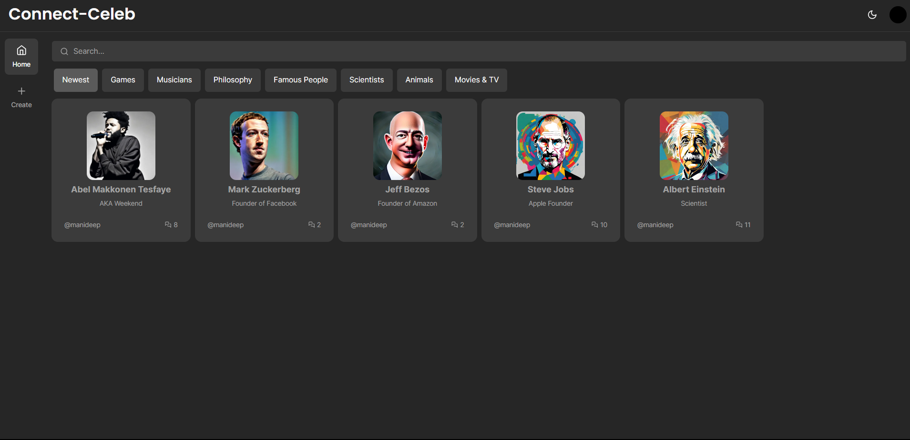

# Connect_Celeb

## Live: https://connect-celeb.vercel.app

<p align = "center">
 
</p>
Connect Celeb is a modern MERN stack Project where it got devloped by using various new technologies which include OPEN AI, Meta's llama-2-13b-chat, google auth and more . This application allow users to have a chat experience with their favourite celebrity they want to talk . These celebrities are AI trained models who were trained to behave and act as same as the respective celebrities.

## Technologies Used

- **Authentication:** Clerk Authentication
- **Front-end:** NextJS, TypeScript, Shadcn, Radix , Tailwind CSS
- **Back-end1:** NodeJS, PineCone vector database , PalnetScale(Sql), Open AI (API) , meta llama-2-13b training model.


## Features:
 - The Celebrity created by a respective user can be used by logined User in the  web application
- But the User who had created the model has the only access to edit or delete the companion information from the application.

## To Create your own Celebrity

The user has to be give the short description of the celebrity and need to provide the sample chat of the celebrity how they talk in few lines.

 ## Installation and Usage

To use this full stack web application, you'll need to follow a few simple steps:

1\. Clone this repository to your local machine.

2\. Install the required dependencies by running `npm install`.

3\. Start the application by running `npm run dev`.


## Getting Started

First, run the development server:

```bash
npm run dev
# or
yarn dev
# or
pnpm dev
# or
bun dev
```

Open [http://localhost:3000](http://localhost:3000) with your browser to see the result.

